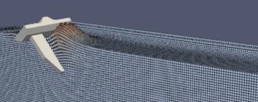
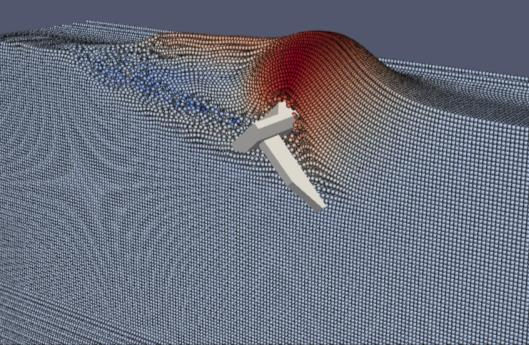

# Applications in Offshore Renewable Energy

The MPM software will enable engineers to model and optimize a wide range of geotechnical challenges in offshore renewable energy deployment. These applications share common characteristics: they are truly three-dimensional, involve large deformation soil-structure interaction, include complex contact and friction effects, and exhibit history-dependent non-linear soil behaviour.

## Primary Application Areas

### 1. Seabed Cable Ploughing

Offshore wind cabling represents **34% of installation costs** and accounts for **83% of all insurance claims** in the offshore wind industry. Cable ploughing involves dragging specialized equipment through the seabed to bury power and communication cables at appropriate depths.

**Challenges the MPM addresses:**

- Predicting plough forces and burial depths in varying soil conditions
- Modeling boulder interaction and obstacle avoidance
- Optimizing plough design for site-specific seabed conditions
- Reducing operational uncertainty and equipment specification risk

By providing accurate predictions of cable burial behavior, engineers can specify appropriate equipment and reduce the risk of cable damage—one of the most significant sources of insurance claims in the offshore wind sector.

### 2. Foundation Installation and Removal

As offshore wind scales to 50GW by 2030 and beyond, thousands of foundations will be installed in increasingly challenging environments. Multiple foundation types are used depending on water depth, soil conditions, and turbine configuration.

**Foundation Types:**

- **Monopiles**: Large-diameter steel piles driven into the seabed
- **Screw piles**: Helical piles screwed into the seabed
- **Suction caissons**: Large cylindrical structures installed by differential pressure
- **Jacket structures**: Multi-legged frameworks with multiple foundation points

**Challenges the MPM addresses:**

- Predicting installation forces, torques, and penetration resistance
- Modeling soil state changes during installation that affect capacity
- Optimizing foundation design for site-specific soil profiles
- Analyzing removal and decommissioning scenarios

For example, existing suction caisson installations may involve 100+ wind turbines, with jacket structures using three suction caissons per turbine—representing hundreds of installations that can be optimized with accurate modeling.

### 3. Site Investigation

Accurate characterization of seabed conditions is essential for all offshore renewable energy projects. Cone Penetration Tests (CPTs) are the primary method for assessing soil properties.

**Challenges the MPM addresses:**

- Inverse analysis of CPT data to determine soil properties
- Modeling complex penetration mechanics in layered soils
- Improving interpretation of site investigation data
- Reducing uncertainty in ground models

Better understanding of CPT behavior through MPM modeling enables more accurate soil characterization, reducing conservatism in design and lowering overall project costs.

### 4. Anchor Penetration and Mooring Systems

Floating offshore wind is projected to reach 5GW by 2030, with future wind farms potentially including 50-100+ floating platforms, each requiring three anchors. This represents hundreds of anchor installations requiring reliable prediction of embedment and capacity.

**Anchor Types:**

- **Drag embedment anchors**: Pulled horizontally through the seabed
- **Deep penetrating anchors**: Installed vertically with high kinetic energy
- **Mooring anchors**: Specialized designs for floating platform systems

**Challenges the MPM addresses:**

- Predicting anchor trajectory and final embedment depth
- Modeling anchor-soil interaction during loading
- Quantifying capacity based on installation-affected soil state
- Optimizing anchor design for site-specific conditions

*MPM simulation of drag anchor initial embedment*

*MPM simulation showing anchor drag trajectory and soil deformation*

As the industry shifts toward floating offshore wind, accurate modeling of mooring and anchor systems becomes increasingly critical for safe and economical deployment.

### 5. Spudcan Penetration, Stability, and Removal

Jack-up vessels are essential for installing offshore wind infrastructure. These vessels use large spudcans (circular or polygonal footing structures) that penetrate the seabed to provide stable working platforms.

**Challenges the MPM addresses:**

- Predicting spudcan penetration resistance in diverse soil conditions
- Assessing stability during punch-through in layered soils
- Modeling extraction forces and techniques
- Managing risk associated with vessel operations in varying seabed conditions

Accurate prediction of spudcan behavior reduces operational risk and enables more efficient use of installation vessels, which represent a significant portion of offshore wind deployment costs.

## Emerging Applications

The offshore renewable energy sector is rapidly evolving, with new technologies and deployment scenarios continuously emerging. The flexible nature of the MPM software enables adaptation to new challenges as they arise.

### Floating Offshore Wind

The transition from fixed-bottom to floating offshore wind turbines introduces new geotechnical challenges:

- Dynamic anchor loading and fatigue
- Seabed interaction of floating platform components
- Installation in deeper water with different soil conditions

### Site-Specific Optimization

Each offshore renewable energy site has unique seabed conditions. The MPM enables:

- Digital twins of site-specific conditions
- Scenario analysis for different equipment and installation strategies
- Risk assessment and uncertainty quantification
- Optimization of installation sequences

## Benefits Across Applications

### Reduced Uncertainty

By modeling the actual physical processes rather than relying on empirical relationships, engineers can:

- Reduce conservatism in designs
- Better quantify uncertainty and manage risk
- Make more informed decisions about equipment selection

### Cost Reduction

More accurate modeling leads to:

- Lower Levelized Cost of Energy through optimized designs
- Reduced operational costs through better equipment specification
- Fewer insurance claims through improved risk management

### Capturing Installation Effects

Traditional "wished-in-place" analyses ignore the soil state changes that occur during installation. The MPM captures these effects, enabling engineers to:

- Account for soil densification or remolding
- Predict post-installation capacity more accurately
- Design for the actual in-service conditions

## Beyond Offshore Renewable Energy

While this project focuses on offshore renewable energy applications, the MPM software has potential applications in other geotechnical challenges involving large deformation soil-structure interaction:

- Slope stability and run-out analysis
- Landslide modeling and hazard assessment
- Subsea infrastructure installation
- Geohazard assessment for offshore developments
- Other large deformation geotechnical problems

The open source nature of the software encourages adoption and extension by the broader geotechnical engineering community.
